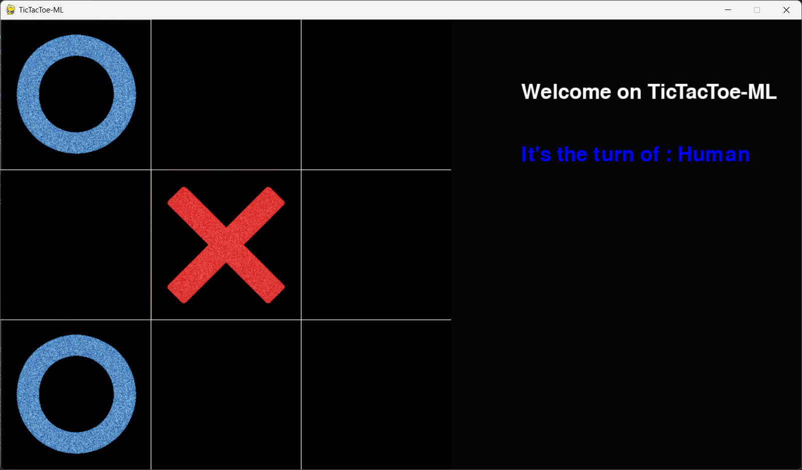

# 🎯 Projet Tic-Tac-Toe avec IA

Bienvenue dans ce projet de **Tic-Tac-Toe** intégrant une intelligence artificielle basée sur l'algorithme Minimax.

## 🚀 Fonctionnalités

- 🎮 Jouez contre une IA optimisée avec Minimax
- 🏆 L'IA anticipe les coups pour maximiser ses chances de victoire
- 📡 Interface graphique en **Pygame**
- 🔄 Option de rejouer après chaque partie

## 🛠️ Installation

1. Clonez le dépôt :
   ```bash
   git clone https://github.com/votre-utilisateur/tic-tac-toe-ai.git
   ```
2. Installez les dépendances :
   ```bash
   pip install -r requirements.txt
   ```
3. Lancez le jeu :
   ```bash
   python main.py
   ```

## 🧠 Algorithme Minimax
L'IA utilise **Minimax** pour évaluer les coups et choisir le meilleur. Elle analyse les scénarios possibles et joue stratégiquement.

## 📌 Améliorations possibles
- ✅ Interface améliorée
- ✅ Optimisation de l'algorithme
- ✅ Optimiser le code

---




---
📌 *N'hésitez pas à contribuer et proposer des améliorations ! | https://discord.gg/H3Aj3x2caw* 🚀

